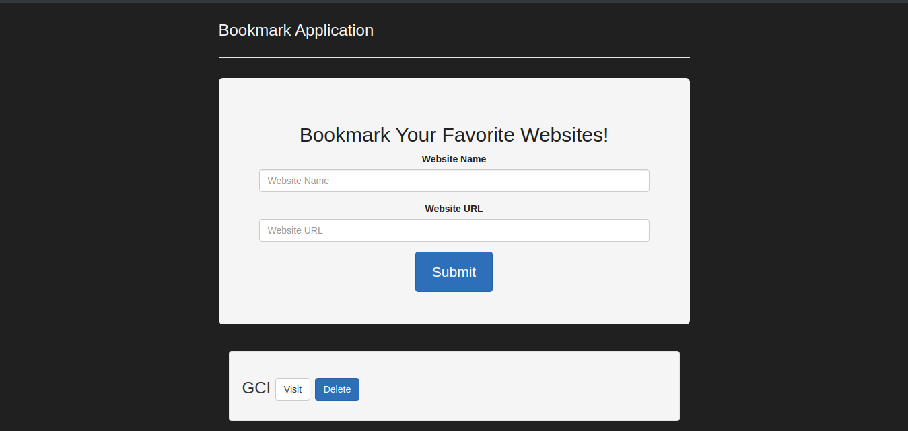
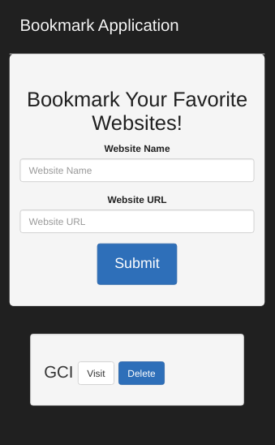

# BOOMARK APPLICATION #

This is a bookmark application where you can add/delete bookmarks from the browser’s local storage.

## Features ##

- Simple UI
- Dark Mode UI
- Validates the URL
- Added Filtering for entering null values.
- Purely JS and CSS

## Sample Screenshots ##

